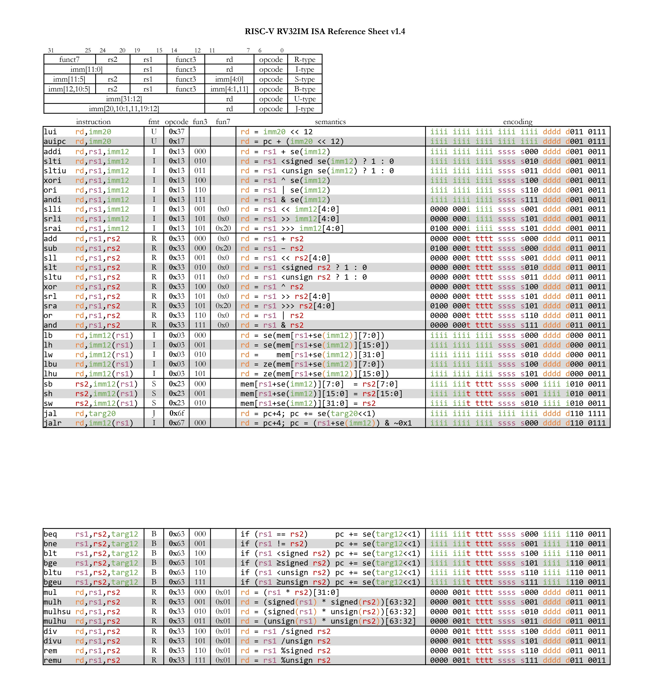

# ProtDSL

### DSL Infrastructure Overview

Проект состоит из нескольких уровней, формирующих DSL для описания и интерпретации инструкций RISC-V. Ниже — последовательность создания файлов и их роли.

1) base.rb — фундамент DSL
Модуль SimInfra и базовая инфраструктура:

- Глобальные методы:
  - field — описание битовых полей инструкции
  - immpart — части immediate-полей
  - assert — простая проверка условий

- Структуры:
  - Field
  - ImmFieldPart

- Инфраструктура:
  - serialize — экспорт инструкций в YAML
  - GlobalCounter — глобальный счётчик для временных переменных
  - @@instructions — накопитель описаний всех инструкций

Базовый слой, на котором строится весь DSL.

2) var.rb — переменные и константы IR
Промежуточное представление (IR):

- IrStmt — единица IR (операция)
- Var — переменная IR, поддерживает:
  - присваивание var[]=...
  - арифметику + / - → генерируют IR-узлы
- Constant — неизменяемая константа IR

3) scope.rb — область видимости и генерация IR
Контейнер для IR-дерева инструкции:

- хранит переменные и родительский scope
- создаёт временные переменные
- преобразует Ruby-выражения в IR (stmt)
    - Виды стэйтментов:
        - :getreg  - переменная = значение регистра
        - :setreg  - значение регистра = переменная 
        - :new_var - объявление переменной 
        - :let     - присваивание значения переменной
        - :se, ze  - знаковое и беззнаковое расширение
        - все операторы приведения типа размером до 32бит
        - bit_extract (битовая маска для извлечения части числа) 
        - все остальные, менее частые, операторы

- определяет операции:
  - add
  - sub
  - resolve_const

4) builder.rb — DSL для объявления инструкций
Главный DSL-конструктор:

- Instruction(name, *args) { ... }
- InstructionInfoBuilder с блоками:
  - encoding
  - asm
  - code

Результат — объект InstructionInfo, содержащий:

- имя инструкции
- аргументы
- поля формата
- ASM-строку
- IR-дерево тела инструкции

5) encoding.rb — форматы кодирования RISC-V
Функции для формирования битовых полей:

- format_r
- format_r_alu

Используют field(...) из base.rb.

6) regfile.rb — регистры
Мини-абстракция для регистров RISC-V:

- XReg — описание регистра
- фабрика XReg(name)

7) 32I.rb — описание ISA (ADD, SUB, ...)

#### Схема:
```C
SimInfra (module)
│
├── GlobalCounter (module)
│     - next_counter
│
├── Field, ImmFieldPart (Struct)
│
├── Constant (class)
│     - @scope, @value
│     - stmt(:new_const)
│
├── Var (class)
│     - @scope, @name, @type
│     - []=
│     - +,-
│
├── Scope (class)
│     - include GlobalCounter
│     - @tree
│     - @vars
│     - stmt
│     - var/add/sub/resolve_const
│
├── InstructionInfo (Struct)
│
├── InstructionInfoBuilder (class)
│     - include SimInfra
│     - @info
│     - encoding
│     - asm
│     - code
│
└── Функции DSL
      Instruction
      field/immpart
      format_r / format_r_alu
      XReg
      assert
```

### RiscV 32IM ISA Reference
<details>

<summary>Reference</summary>
    
</details>

