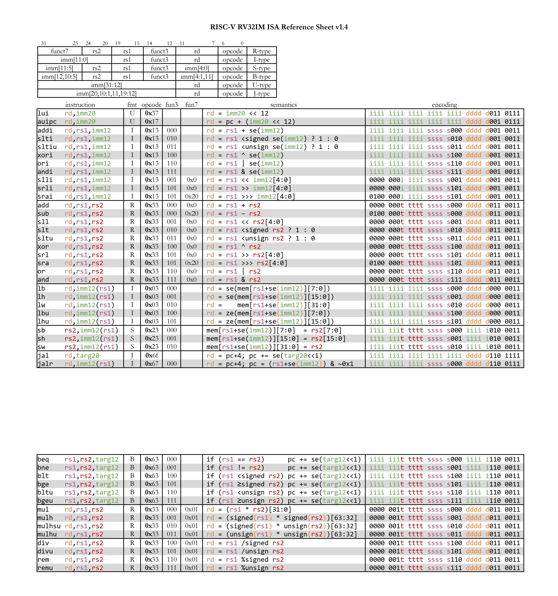

# DSL

Ruby-based **DSL для описания инструкций RISC-V**, генерации промежуточного представления и последующего создания частей интерпретатора/симулятора.

Проект позволяет описывать инструкции декларативно: задать кодирование, строку ASM и семантику инструкции на DSL-уровне, а затем сгенерировать артефакты для дальнейшей сборки симулятора.

## Что делает проект

- описывает инструкции ISA через Ruby DSL;
- хранит описание инструкций в общем IR;
- сериализует IR в `result/generated/IR.yaml`;
- генерирует декодер и исполнитель для целевой архитектуры;
- содержит target-описание для **RISC-V 32IM**;
- собирает итоговый бинарник `sim` через `g++`.

## Основная идея

В проекте есть несколько уровней:

1. **Базовая инфраструктура DSL**
   - описание полей инструкции;
   - описание immediate-полей;
   - проверки и сериализация.

2. **IR-уровень**
   - переменные, константы, выражения и statements;
   - области видимости;
   - временные переменные;
   - базовые и составные операции.

3. **Instruction Builder**
   - DSL-конструктор `Instruction(...)`;
   - блоки `encoding`, `asm`, `code`;
   - сборка полной структуры `InstructionInfo`.

4. **Target-слой**
   - кодировки форматов инструкций;
   - регистровый файл;
   - описание ISA RISC-V 32IM;
   - генерация decoder/execute-частей.

## Структура проекта

```text
.
├── Generic/              # базовая DSL-инфраструктура и IR
│   ├── base.rb
│   ├── builder.rb
│   ├── scope.rb
│   └── var.rb
├── Target/RISC-V/        # target-описание для RISC-V
├── 3rdparty/             # внешние зависимости
├── executables/          # вспомогательные исполняемые файлы
├── result/               # generated output
├── test_gen/             # генерация/тестовые артефакты
├── readme_src/           # картинки для README
├── main.rb               # запуск генерации
├── build.sh              # сборка итогового симулятора
└── README.md
```

## Ключевые файлы

### `Generic/base.rb`
Базовый слой DSL:

- `field(...)` — описание битовых полей инструкции;
- `imm_parts(...)` — описание частей immediate;
- `assert(...)` — простые проверки;
- `serialize(...)` — выгрузка IR в YAML.

### `Generic/var.rb`
IR-объекты:

- `IrStmt` и `IrExpr`;
- `Var` для переменных;
- `Constant` для констант;
- перегруженные операции, которые строят IR, а не вычисляют значение сразу.

### `Generic/scope.rb`
Контейнер IR-дерева инструкции:

- хранит переменные текущего scope;
- создаёт временные переменные;
- добавляет statements/expressions;
- содержит базовые операции и составные операции для ISA.

### `Generic/builder.rb`
Главный слой DSL:

```ruby
Instruction(name, *args) do
  encoding ...
  asm { ... }
  code { ... }
end
```

На выходе формируется `InstructionInfo` с кодировкой, аргументами, ASM-представлением и IR-кодом.

### `Target/RISC-V/32IM.rb`
Описание инструкций RISC-V 32IM:

- R-type ALU;
- multiply/divide;
- I-type arithmetic;
- shift;
- memory;
- branch;
- jump;
- system instructions.

## Как работает генерация

Запуск начинается с `main.rb`:

1. подключаются базовые DSL-модули;
2. загружается описание ISA `Target/RISC-V/32IM.rb`;
3. сериализуется IR;
4. запускается генерация execute-части;
5. запускается генерация decode-части.

## Сборка

### Генерация и сборка симулятора

```bash
./build.sh
```

Скрипт запускает `ruby main.rb`, а затем компилирует итоговые C++-файлы в бинарник `sim`.

### Очистка

```bash
./clean.sh
```

## Пример DSL-описания инструкции

Упрощённо инструкция задаётся так:

```ruby
Instruction(name, XReg(:rd), XReg(:rs1), XReg(:rs2)) do
  encoding ...
  asm { "#{name} #{rd}, #{rs1}, #{rs2}" }
  code { rd[] = rs1.send(name, rs2) }
end
```

Такой подход позволяет держать **формат**, **ассемблерное представление** и **семантику** инструкции в одном месте.

## RiscV 32IM ISA Reference
<details>

<summary>Пример с сайта университета University of Pennsylvania School of Engineering and Applied Science</summary>
    
</details>